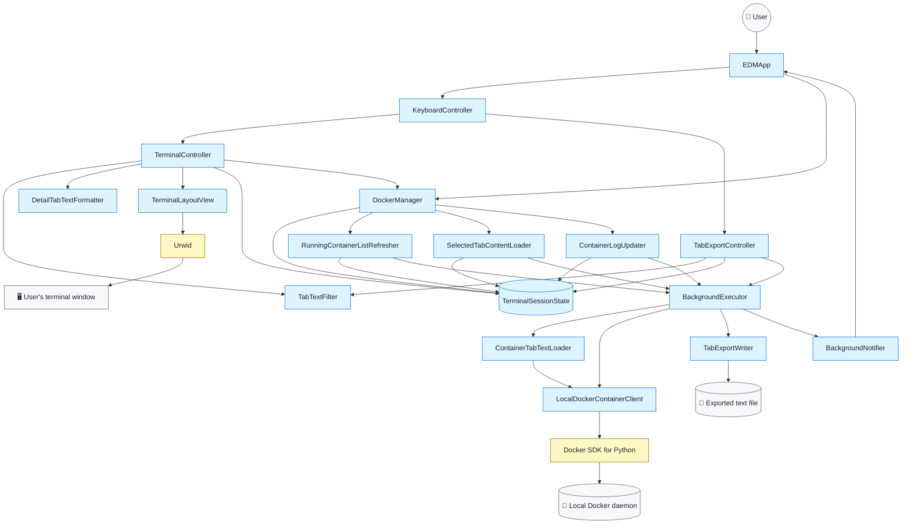
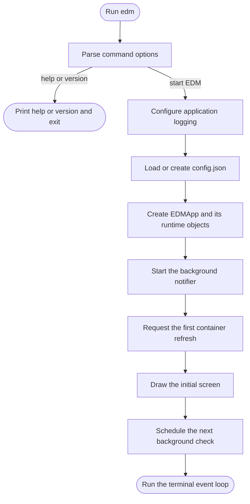
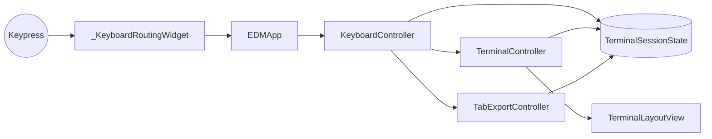
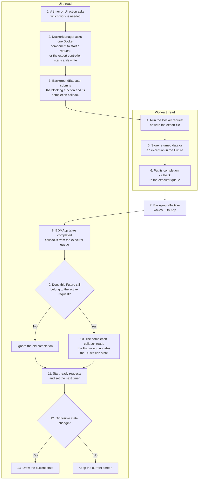
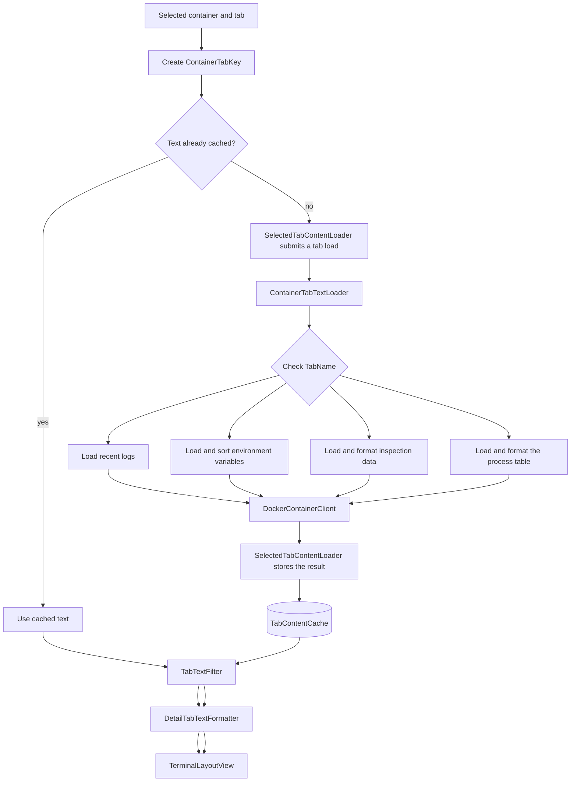

# Easy Docker Manager Development Guide

This guide explains how EDM starts, how Docker data reaches the screen, and
where each part of the code belongs.

## Project Structure

```text
src/
  easy_docker_manager/
    main.py                       Program entry point
    constants.py                  Shared application identity values

    app/
      app.py                      Application startup, event handling, shutdown
      runtime_factory.py          Creates and connects runtime objects
      background_notifier.py      Reports finished work to the UI thread
      background_executor.py      Runs blocking functions in worker threads
      docker_manager.py
                                  Coordinates the Docker data components
      running_container_refresh.py
                                  Refreshes the list and preserves its selection
      selected_tab_load.py        Loads the selected container tab
      container_log_updates.py    Polls and merges container logs

    config/
      app_config_store.py         Loads and rewrites config.json

    core/
      config.py                   AppConfig values and validation
      running_container_list.py  Keeps Docker's list and the displayed list
      container_sorting.py       Container sort fields and ordering
      containers.py               Container and process data classes
      tab_content_cache.py        Size-limited tab text cache
      log_text.py                 Log trimming and duplicate-line handling
      tabs.py                     Detail tab names
      terminal_session_state.py   State for the current terminal session

    docker/
      container_client.py         DockerContainerClient interface and EDM errors
      client_factory.py           Creates the local Docker SDK client
      container_mapper.py         Converts Docker objects to EDM data
      error_mapping.py            Converts Docker SDK errors to EDM errors
      local_container_client.py   Sends requests to the local Docker daemon
      log_availability.py         Checks whether Docker can read container logs

    tabs/
      config_tab_formatter.py     Formats Docker inspection data
      tab_data_loader.py          Loads text for Logs, Env, Config, and Top
      tab_text_filter.py          Chooses the lines visible after a search

    tab_export/
      definitions.py              Export menu choices and file-write request
      writer.py                   Writes tab snapshots to UTF-8 text files

    ui/
      running_container_list_panel.py
                                  Builds the running-container list panel
      container_sort_menu.py      Builds the container sorting menu
      container_details_panel.py Builds the selected container details panel
      formatting.py               Adds terminal colors and search highlights
      keyboard_controller.py      Maps keypresses to actions
      tab_export_controller.py    Handles the export workflow
      tab_export_menu.py          Builds the export popup menu
      terminal_layout.py          Combines panels, popups, and the footer
      terminal_controller.py      Handles navigation, filtering, and drawing

    logging/
      app_logging.py              Configures EDM application logging

tests/
  integration_tests/              Tests against a temporary Docker container
  smoke_tests/                    Startup checks for supported operating systems
  unit_tests/                     Unit tests for all EDM modules
```

## Main Parts

The colors show where each part comes from:

- Blue nodes are code developed in EDM.
- Yellow nodes are third-party Python packages used by EDM.
- Gray nodes are people or systems outside the application.

Read the diagram from top to bottom. `EDMApp` receives user input and sends it
toward a screen update, Docker request, or file export. When background work
finishes, `BackgroundNotifier` wakes `EDMApp` so it can handle the result.



The main responsibilities are:

- `EDMApp` starts and stops the terminal application. It also receives
  keypresses and finished background work.
- `KeyboardController` decides what a key means.
- `TerminalController` changes selections, switches tabs, handles container
  filtering, sorting, and tab searches, and prepares the screen for drawing.
- `TabExportController` edits export choices, prepares a cached text snapshot,
  and handles the result of the file write.
- `TabTextFilter` applies the same line-visibility rules to the terminal and
  Current view exports.
- `DockerManager` gives the rest of EDM one place to request Docker data. It
  passes container-list, tab-load, and log-poll work to the matching class.
- `RunningContainerListRefresher`, `SelectedTabContentLoader`, and
  `ContainerLogUpdater` each track one type of request, including its timer,
  active `Future`, result handling, and state changes.
- `BackgroundExecutor` runs Docker requests and file writes outside the UI
  thread.
- `TerminalLayoutView` combines the two panels, popups, and shortcut footer.
  Together, these visible parts are called the terminal view.
- `RunningContainerListPanel` and `SelectedContainerDetailsPanel` update the
  Urwid widgets in their panel.
- `LocalDockerContainerClient` is the only class that calls the Docker SDK.

## Startup



`easy_docker_manager.main` first parses the command options. `--help` and
`--version` print their output and exit without starting the application.
`--no-color` starts EDM with a temporary no-color override. Starting EDM then
performs three steps:

1. Configure EDM's application log.
2. Load `AppConfig` from `config.json`.
3. Create `EDMApp` and call `run()`.

`EDMApp` uses `EDMRuntimeFactory` to create and connect the state, Docker
client, background executor, controllers, formatter, and terminal view. This
keeps setup code out of `EDMApp` and lets tests provide another config or
Docker client.

When the terminal application stops, `EDMApp` stops notifications, waits for
worker threads to finish, and then closes the Docker client.

## Configuration And Logging

`AppConfigStore` uses `platformdirs` to find the user config directory. Both
files live in its `EDM` folder:

```text
EDM/
  config.json
  edm.log
```

On each startup, `AppConfigStore`:

1. Reads `config.json` when it exists and contains a JSON object.
2. Starts with the defaults in `AppConfig`.
3. Keeps known values with valid types and valid ranges.
4. Uses defaults for missing or invalid values.
5. Rewrites the file, which removes settings unknown to this EDM version.

This is enough for normal upgrades and downgrades. A renamed setting counts as
a new setting unless `AppConfigStore` contains a specific migration for it.

`configure_logging()` runs before config loading so it can also report config
errors. It writes EDM's own messages to a rotating `edm.log` file. Container
logs are shown in the Logs tab and are not written to this file.

## Keyboard Input



`_KeyboardRoutingWidget` passes each Urwid key name to `EDMApp`.

`KeyboardController` handles simple key behavior, such as entering filter or
search input and changing keyboard focus. It calls `TerminalController` for
navigation, filtering, sorting, tab changes, and detail scrolling. While the
export menu is open, it passes every key to `TabExportController`, which keeps
the export rules in one place.

The controller returns a `KeyAction`:

- `NONE`: nothing visible changed.
- `REDRAW`: draw the screen again and check whether background work should start.
- `QUIT`: leave the terminal application.

### Container Filtering

The keys and visible behavior are documented in
[Container Filtering](README.md#container-filtering).

`TerminalSessionState.container_filter_query` stores the query applied to the
running-container list. `container_filter_query_before_editing` stores the
previous query while input is active. `Enter` keeps the edited query. `Esc`
restores the saved query. Other shortcuts are ignored until editing ends.

`RunningContainerList` keeps the latest list received from Docker and the
sorted, filtered list shown in the left panel. Each query change asks
`DockerManager` to rebuild the displayed list from the Docker list. Sorting is
applied first, followed by the filter. The comparison ignores letter case and
checks the container name, image name, and status. It is quick because it only
reads container summaries already held in memory.

If the selected container still matches, it remains selected. Otherwise, EDM
selects the first match and prepares that container's active tab. Containers
hidden by the filter are still running, so their cached tab text and log
tracking are not removed. A later Docker refresh reapplies the same sort and
filter to the new list.

### Container Sorting

The menu and its keyboard controls are documented in
[Container Sorting](README.md#container-sorting). Sorting uses a small Urwid
popup rather than opening another terminal window.

While the sort menu is open, `KeyboardController` handles its keys before the
normal shortcuts. `TerminalSessionState.container_sort_menu_state` stores the
choices shown in the menu. The active sort changes only when the user presses
`Enter`, so `Esc` can close the menu without changing the list.

When `Enter` applies the choice, `DockerManager` sorts the latest list received
from Docker and then reapplies the active filter. It also finds the selected
container's new position. The same container and loaded tab stay selected when
that container still matches. Later refreshes use the same sort. `Docker order`
restores Docker's order before the active filter is applied.

### Tab Export

The popup and its keyboard controls are documented in
[Exporting Tab Content](README.md#exporting-tab-content).

One `TabExportController` handles exports for Logs, Env, Config, and Top. The
active `ContainerTabKey` records which container and tab the export belongs to.
An export follows these steps:

1. The user presses `e` while the details panel is active.
2. `KeyboardController` asks `TabExportController` to open the popup.
3. While the popup is open, `KeyboardController` passes each key to
   `TabExportController.handle_menu_keypress()`.
4. `TerminalSessionState.tab_export_menu_state` stores the path, scope, selected
   field, and current menu phase.
5. When the user presses `Enter`, the controller reads the tab text already in
   `TabContentCache`. It does not make another Docker request.
6. Current view applies the active Logs filter. Full loaded tab keeps all
   cached text. Searches on Env, Config, and Top do not remove lines.
7. The controller creates a `TabExportRequest` containing that fixed text
   snapshot and sends `TabExportWriter.export_text()` to
   `BackgroundExecutor`.
8. The completion callback closes the popup after success. If the path exists,
   it asks for confirmation. Other errors leave the popup open so the path can
   be corrected.

Confirmed replacements use a temporary file in the destination directory.
The existing file is replaced only after all new content has been written.

## Background Work

Docker requests and file writes can be slow, so they run in worker threads.
Urwid widgets and `TerminalSessionState` are changed only on the UI thread.

These objects split the background work:

- `DockerManager` asks the matching Docker data class to start work and
  reports how long EDM should wait before checking again.
- `RunningContainerListRefresher`, `SelectedTabContentLoader`, and
  `ContainerLogUpdater` each handle one kind of Docker request from start to
  finish.
- `TabExportController` prepares a user-requested export and handles its result.
- `BackgroundExecutor` runs the blocking function in a worker thread. It does
  not need to know whether the function reads Docker or writes a file.

Read this diagram from top to bottom. The worker thread does the blocking work.
All state changes happen later on the UI thread.



### Docker Data Components

`EDMApp` and `TerminalController` request Docker data through `DockerManager`.
Three smaller classes do the actual request tracking:

| Component | What it handles |
| --- | --- |
| `RunningContainerListRefresher` | Container-list refreshes, selection preservation, and stopped-container cleanup |
| `SelectedTabContentLoader` | Initial tab loads, cached-tab reuse, and periodic Env, Config, and Top refreshes |
| `ContainerLogUpdater` | Incremental log polls, Docker since timestamps, overlap removal, and log limits |

Initial logs are limited once by `ContainerTabTextLoader` while its Docker request runs
in a worker thread. Incremental updates need two steps: each fetched batch is
limited in the worker, then the combined old and new log text is limited again
before it is cached. The second step keeps the complete displayed history
within the configured line and character limits.

A failed container-list refresh keeps the last successful list visible. Env,
Config, and Top also keep their last successful text after a temporary refresh
error because that snapshot can still be useful.

Logs behave differently. If Docker cannot fetch them, EDM removes the cached
log lines and shows the error in the Logs panel. This prevents old lines from
looking current. Errors are stored separately from status text, so a successful
retry can clear the correct error without comparing displayed messages.

A `Future` represents work running in another thread. Each Docker refresh class
keeps its active `Future` so it cannot start the same request twice. Before a
completion callback changes state, it checks that the completed `Future` is
still the active one. This stops an older request from overwriting newer data.

A Docker request that has started cannot be stopped. If the user changes
container or tab while a tab load is running, the old request finishes first.
Its text is cached under the container and tab that requested it.
`SelectedTabContentLoader` then starts a load for the current selection.

Each successful log request saves the time at which it started. The next Docker
request uses that time as its `since_timestamp`, which asks for lines written
from that point onward. A failed request keeps the old timestamp so a retry
does not skip output. Docker can repeat lines where two requests meet;
`count_repeated_lines_between_batches()` removes that repeated section before
new lines are added to the cache.

Env, Config, and Top reload while they are visible, using
`tab_refresh_interval`. Hidden tabs are left alone. Logs has a separate polling
path that asks only for newer lines.

### Background Executor And Notifier

`BackgroundExecutor.submit()` receives three things:

1. The blocking function to run.
2. The arguments for that function.
3. An `on_complete` callback that knows how to handle its Future.

For example, a container refresh submits
`DockerContainerClient.list_running_containers` together with
`RunningContainerListRefresher._apply_running_container_list_refresh_result`.
The first function runs in a worker. The second function runs later on the UI
thread.
Tab export follows the same pattern with `TabExportWriter.export_text()` and
the completion method in `TabExportController`.

When a worker finishes, the executor puts its completion callback in a queue
and notifies `BackgroundNotifier`. On Unix-like systems,
`PipeBackgroundNotifier` wakes Urwid through `watch_pipe`. On Windows,
`PollingBackgroundNotifier` checks for queued work every 0.2 seconds. Both
paths cause `EDMApp` to take the callbacks from the queue and run them on the
UI thread.

## Loading A Detail Tab



`ContainerTabTextLoader.load_tab_text()` checks the requested `TabName` and calls one
small private method. Logs loads the first group of recent lines. Env sorts
environment variables by name. Config sends Docker inspection data to
`format_container_inspection_data()`. Top turns Docker's process columns and rows into
text.

The loader returns text or lets a Docker error continue to
`SelectedTabContentLoader`. It does not change session state, update the cache,
or draw widgets. Later log polls do not use `ContainerTabTextLoader`;
`ContainerLogUpdater` requests and merges those lines directly.

## State And Cache

`TerminalSessionState` holds the changing data for one run of EDM. Controllers
and the three Docker data components update it. The terminal views only read
it.

Important fields are:

| Field | Meaning |
| --- | --- |
| `running_container_list` | Latest Docker list and the sorted, filtered list shown in the left panel |
| `selected_container_index` | Selected position in that list |
| `container_filter_query` | Plain-text query matched against container names, images, and statuses |
| `container_filter_query_before_editing` | Query to restore if filter editing is cancelled, or `None` when editing is inactive |
| `container_sort_field` | Sort field currently applied to the container list |
| `container_sort_descending` | Whether the active sort runs in descending order |
| `container_sort_menu_state` | Temporary choices in the open sort menu, or `None` when it is closed |
| `tab_export_menu_state` | Path, scope, selection, and phase of the open export menu, or `None` when it is closed |
| `active_detail_tab_name` | Logs, Env, Config, or Top |
| `active_focus_area` | Panel that receives navigation keys |
| `detail_selected_line_index` | Selected line in the detail panel |
| `follow_log_tail` | Whether Logs stays on the newest line |
| `status_message` | Message below the detail panel |
| `is_search_active` | Whether keypresses are editing a search query |
| `tab_content_cache` | Loaded text for each container tab |
| `tab_search_queries` | Search query for each container tab |
| `unreadable_log_container_ids` | Containers whose logging driver cannot be read |
| `container_list_refresh_error_message` | Latest container-list refresh error, cleared after recovery |
| `tab_content_error_messages` | Latest load, refresh, or log-poll error for each container tab |

`ContainerTabKey` combines a container ID and `TabName`. It is used for cached
text, search queries, and loading errors so each container tab keeps its own
data.

`TabContentCache` has two limits:

- `tab_content_cache_max_entries` limits the number of cached tabs.
- `tab_content_cache_max_bytes` limits the combined UTF-8 size of cached text.

When either limit is exceeded, the least recently used entries are removed.
State belonging to stopped containers is also removed after a successful
container refresh.

## Display And Search

`TerminalController.get_active_detail_tab_display_lines()` chooses what the
detail panel should show: a loading message, an error, an empty-state message,
or loaded text.

`TabTextFilter` chooses which loaded lines remain visible:

- Logs uses a case-insensitive regular expression. Lines that do not match are
  hidden. Invalid expressions leave the full log text visible.
- Env, Config, and Top keep every line visible.

`DetailTabTextFormatter` then adds terminal colors and highlights matching
text. Env, Config, and Top use case-insensitive plain-text highlighting. Logs
highlights the regular expression matches that passed the filter.

Queries are stored by `ContainerTabKey`, so switching away and back restores
the same search. Log regular expressions are limited to 200 characters.

`DetailLineRenderer` adds colors for timestamps, log levels, numbers,
environment keys, structured values, search matches, and errors.

## Main Classes

### App

| Class or module | What it does |
| --- | --- |
| `easy_docker_manager.main` | Handles CLI options or configures logging, loads config, and starts `EDMApp` |
| `EDMApp` | Starts the UI, receives input and task notifications, and closes resources |
| `_KeyboardRoutingWidget` | Passes terminal keypresses to `EDMApp` |
| `EDMRuntimeFactory` | Creates and connects the objects used by `EDMApp` |
| `EDMRuntime` | Holds the objects that `EDMApp` uses directly |
| `DockerManager` | Delegates Docker work and calculates the next overall refresh delay |
| `RunningContainerListRefresher` | Refreshes the running-container list, preserves selection, and removes stopped-container state |
| `SelectedTabContentLoader` | Loads and periodically refreshes selected-tab content |
| `ContainerLogUpdater` | Polls for new logs and updates cached log text |
| `BackgroundExecutor` | Runs blocking functions and queues their completion callbacks |
| `BackgroundNotifier` | Defines how finished work is reported to `EDMApp` |
| `PipeBackgroundNotifier` | Provides immediate notification on Unix-like systems |
| `PollingBackgroundNotifier` | Checks for notification every 0.2 seconds on Windows |

### Config And Core

| Class or module | What it does |
| --- | --- |
| `AppConfig` | Stores validated refresh, log, cache, timeout, worker, and color settings |
| `AppConfigStore` | Loads, checks, and rewrites `config.json` |
| `ContainerSummary` | Stores the container fields shown in the left panel |
| `RunningContainerList` | Stores all running containers and builds the sorted, filtered list shown in EDM |
| `ContainerSortField` | Names the choices shown in the container sorting menu |
| `get_container_list_in_requested_order` | Returns a sorted copy of the latest Docker container list |
| `ContainerProcessTable` | Stores process column names and rows from Docker top |
| `TabName` | Names the four detail tabs |
| `FocusArea` | Names the container and detail keyboard focus areas |
| `TerminalSessionState` | Stores changing data for the current terminal session |
| `ContainerTabKey` | Identifies one tab for one container |
| `TabContentCache` | Keeps recently used tab text within count and byte limits |
| `TabExportMenuState` | Stores the path and scope while the export popup is open |
| `TabExportPhase` | Says whether the export menu is being edited, writing a file, or confirming replacement |
| `TabExportRequest` | Carries one fixed text snapshot to the file writer |

### Docker, Tabs, And Export

| Class or module | What it does |
| --- | --- |
| `DockerContainerClient` | Defines the container data EDM needs |
| `LocalDockerContainerClient` | Implements that interface with the local Docker SDK |
| `FailedDockerRequestType` | Identifies the Docker request that failed |
| Docker error classes | Describe missing containers, failed refreshes, failed requests, and unreadable logs |
| `create_docker_client` | Creates a local Docker SDK client and rejects remote `DOCKER_HOST` transports |
| `to_container_summary` | Converts a Docker container object to `ContainerSummary` |
| `ContainerTabTextLoader` | Loads and formats the full text for a requested detail tab |
| `TabTextFilter` | Chooses visible lines for the terminal and Current view exports |
| `TabExportWriter` | Writes a prepared tab snapshot without silently replacing a file |

### UI

| Class or module | What it does |
| --- | --- |
| `KeyboardController` | Turns keypresses into state and navigation actions |
| `KeyAction` | Tells `EDMApp` to do nothing, redraw, or quit |
| `TerminalController` | Handles navigation, filtering, search, menu choices, and drawing |
| `TabExportController` | Handles export choices, cached text snapshots, and file-write results |
| `TerminalLayoutView` | Combines the panels, active popup, and shortcut footer |
| `RunningContainerListPanel` | Displays the running-container list, header, footer, and border |
| `SelectedContainerDetailsPanel` | Displays the selected container's tabs, rows, status, and border |
| `ContainerSortMenuState` | Holds choices being edited in the sort menu |
| `build_container_sort_popup_menu` | Builds the sort popup menu over the main layout |
| `build_tab_export_popup_menu` | Builds the export popup menu over the main layout |
| `FocusableDetailLine` | Lets keyboard navigation select one line of detail text |
| `DetailTabTextFormatter` | Adds tab colors and search highlights to visible lines |
| `DetailLineRenderer` | Adds tab colors, search highlights, and error colors |

## Adding A Detail Tab

1. Add the new value to `TabName`.
2. Add a private loading method in `ContainerTabTextLoader` and call it from
   `load_tab_text()` for the new value.
3. Update `TabTextFilter` if the tab needs different line-visibility rules.
4. Add formatting rules only if the tab needs different colors or highlights.
5. Check tab switching, loading, empty content, errors, and search behavior.

## Adding A Config Setting

1. Add the field and validation to `AppConfig`.
2. Use that field where the setting is needed.
3. Run EDM once and inspect the rewritten `config.json`.
4. Update the README configuration table.

If a setting is renamed, the old key is removed and the new key receives its
default. Add a migration in `AppConfigStore` only when the old value must be
kept.

## Development Setup

Create a virtual environment:

```bash
python -m venv .venv
```

Activate it on Linux or macOS:

```bash
source .venv/bin/activate
```

Activate it in Windows PowerShell:

```powershell
.venv\Scripts\Activate.ps1
```

Or activate it in Windows Command Prompt:

```bat
.venv\Scripts\activate.bat
```

Install EDM and all development tools:

```bash
python -m pip install --upgrade pip
python -m pip install --group dev --group security -e .
```

The `dev` and `security` dependency groups contain tools used only while
working on EDM. They are not included when the package is built or installed
from PyPI.

## Development Commands

Run the checks used during normal development:

```bash
make check
```

`make check` runs Black in check mode, Ruff, mypy, Bandit, and the unit tests.
It supports Python 3.9 and does not need network access.

Other useful commands are:

| Command | Purpose |
| --- | --- |
| `make black` | Format Python files |
| `make black-check` | Check formatting without changing files |
| `make ruff` | Run Ruff |
| `make ruff-fix` | Let Ruff fix supported issues |
| `make mypy` | Check Python types |
| `make bandit` | Check Python source for common security problems |
| `make test` | Run unit tests and print statement and branch coverage |
| `make integration-test` | Test Docker data access with a temporary container |
| `make smoke-test` | Check package startup on the current operating system |
| `make pre-commit` | Run every configured pre-commit hook |
| `make audit` | Check dependencies for known vulnerabilities |
| `make security` | Run Bandit and the dependency audit |
| `make package-build` | Build the source distribution and wheel |
| `make package-check` | Build packages and validate their metadata |

`make audit` requires Python 3.10 or newer and network access.

GitHub Actions:

- runs Black, Ruff, mypy, and Bandit once on Python 3.12
- runs unit tests on Python 3.9 through 3.14
- runs real Docker integration tests on Python 3.12
- tests the built wheel on Windows and macOS
- tests the minimum supported runtime dependencies on Python 3.9
- runs dependency review for pull requests
- runs `pip-audit` and Gitleaks
- builds and validates the source distribution and wheel
- installs the wheel on Python 3.9 through 3.14

Dependabot checks Python packages and GitHub Actions every week. GitHub secret
scanning and push protection are repository settings and should be enabled
separately.

## Publishing A Release

EDM uses `setuptools-scm` to get the package version from a Git tag. Do not edit
a version in `pyproject.toml`. A tag such as `v1.0.1` produces package version
`1.0.1`.

Before creating a release, update `main` and run the local checks:

```bash
git switch main
git pull --ff-only
git status
make check
```

Make sure the working tree is clean and the required GitHub checks have passed
on `main`. Then create an annotated tag for the new semantic version, review
it, and push it:

```bash
git tag -a v1.0.0 -m "Release Easy Docker Manager 1.0.0"
git show v1.0.0
git push origin v1.0.0
```

Pushing the tag starts `.github/workflows/release.yml`. The workflow builds and
tests the package, creates the GitHub Release, and then waits for approval to
use the protected `pypi` environment. Review the completed jobs before
approving the PyPI publication.

Do not move or reuse a release tag after pushing it. If the source or package
files need to change, make the fix on `main` and publish a new version.

## Recording The README Demo

[VHS](https://github.com/charmbracelet/vhs) records terminal actions as a text
file and replays them to create a GIF or video. EDM keeps the maintained tape
at `docs/demos/edm-demo.tape` and the generated README animation at
`docs/assets/edm-demo.gif`.

VHS requires `ffmpeg` and `ttyd`. Install it by following the
[official VHS instructions](https://github.com/charmbracelet/vhs#installation),
or use one of these supported package managers:

```bash
# macOS or Linux with Homebrew
brew install vhs

# Windows
winget install charmbracelet.vhs
```

Check the installation:

```bash
vhs --version
```

Use `docs/demos/edm-demo.tape` as the base template. Record a new session into
a temporary file so the maintained tape is not overwritten:

```bash
vhs record > edm-demo-recording.tape
```

In the recording shell, run `edm` and demonstrate the main workflows. Press
`q` to close EDM, then type `exit` to finish recording. Copy the useful action
commands from `edm-demo-recording.tape` to the end of the maintained tape.
The temporary recording is ignored by Git.

Validate the tape, then regenerate the GIF from the repository root:

```bash
vhs validate docs/demos/edm-demo.tape
vhs docs/demos/edm-demo.tape
```

Use dedicated demo containers. Before committing the GIF, check every frame
for passwords, tokens, internal hostnames, private URLs, and sensitive log or
container data.
