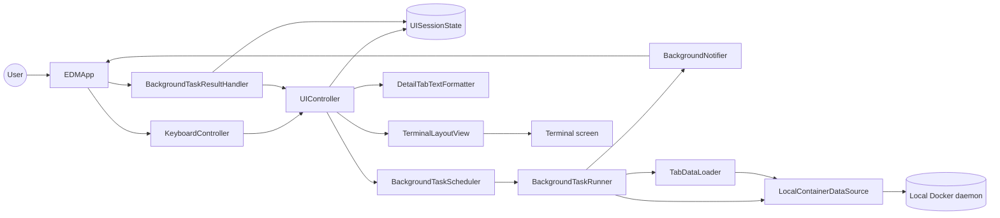
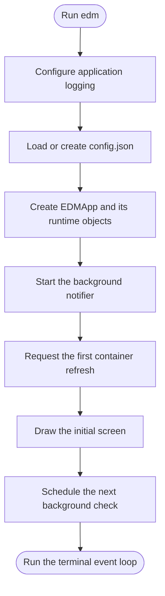
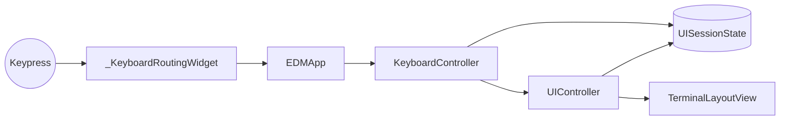
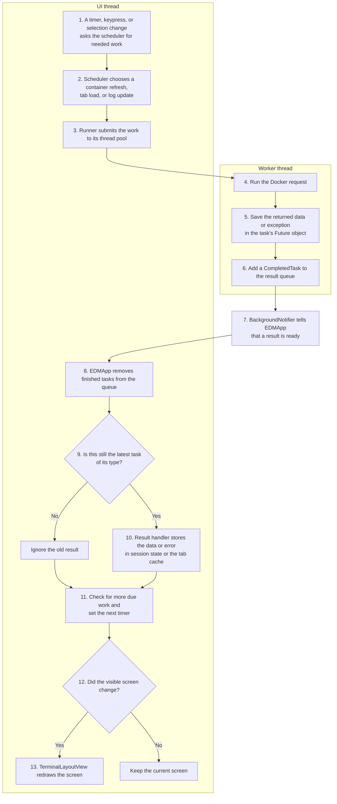
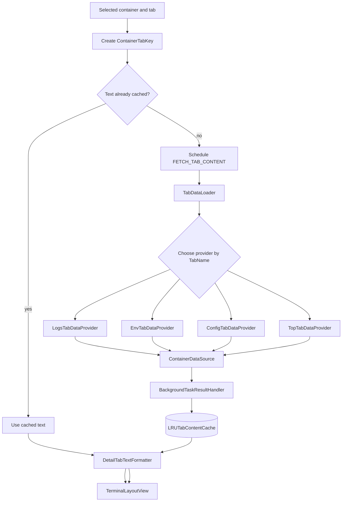

# Easy Docker Manager Development Guide

This guide explains how EDM starts, how Docker data reaches the screen, and
where each part of the code belongs.

## Project Structure

```text
src/
  easy_docker_manager/
    main.py                       Program entry point
    constants.py                  Shared application identity values

    app/
      app.py                      Application startup, event handling, shutdown
      runtime_factory.py          Creates and connects runtime objects
      background_notifier.py      Reports finished work to the UI thread
      background_task_runner.py   Runs blocking work in worker threads
      background_task_result_handler.py
                                  Applies finished work to UI state
      scheduler.py                Starts refresh, tab, and log work when needed

    config/
      app_config_store.py         Loads and rewrites config.json

    core/
      config.py                   AppConfig values and validation
      containers.py               Container and process data classes
      content_cache.py            Size-limited tab text cache
      log_text.py                 Log trimming and duplicate-line handling
      tabs.py                     Detail tab names
      ui_session_state.py         State for the current terminal session

    docker/
      base.py                     ContainerDataSource interface and EDM errors
      client_factory.py           Creates the local Docker SDK client
      container_mapper.py         Converts Docker objects to EDM data
      error_mapping.py            Converts Docker SDK errors to EDM errors
      local.py                    Reads data from the local Docker daemon
      log_availability.py         Checks whether Docker can read container logs

    tabs/
      config_tab_formatter.py     Formats Docker inspection data
      tab_data_loader.py          Loads text for Logs, Env, Config, and Top

    ui/
      formatting.py               Filters lines and adds terminal colors
      keyboard_controller.py      Maps keypresses to actions
      terminal_layout.py          Builds and updates Urwid widgets
      ui_controller.py            Coordinates navigation, loading, and drawing

    logging/
      app_logging.py              Configures EDM application logging

tests/
  unit_tests/                     Unit tests for all EDM modules
```

## Main Parts



The main responsibilities are:

- `EDMApp` starts and stops the terminal application. It also receives
  keypresses and finished background work.
- `KeyboardController` decides what a key means.
- `UIController` changes selections, switches tabs, requests missing data, and
  prepares the screen for drawing.
- `BackgroundTaskScheduler` decides when a Docker request should start.
- `BackgroundTaskRunner` runs Docker requests outside the UI thread.
- `BackgroundTaskResultHandler` stores finished results in session state.
- `TerminalLayoutView` owns and updates the Urwid widgets.
- `LocalContainerDataSource` is the only class that calls the Docker SDK.

## Startup



`easy_docker_manager.main` performs three steps:

1. Configure EDM's application log.
2. Load `AppConfig` from `config.json`.
3. Create `EDMApp` and call `run()`.

`EDMApp` uses `EDMRuntimeFactory` to create the state, Docker data source,
background services, controllers, formatter, and terminal view. Keeping this
setup in one factory makes the application constructor smaller and allows a
different data source or runtime factory to be supplied when needed.

When the terminal application stops, `EDMApp` stops notifications, waits for
worker threads to finish, and then closes the Docker client.

## Configuration And Logging

`AppConfigStore` uses `platformdirs` to find the user config directory. Both
files live in its `EDM` folder:

```text
EDM/
  config.json
  edm.log
```

On each startup, `AppConfigStore`:

1. Reads `config.json` when it exists and contains a JSON object.
2. Starts with the defaults in `AppConfig`.
3. Keeps known values with valid types and valid ranges.
4. Uses defaults for missing or invalid values.
5. Rewrites the file, which removes settings unknown to this EDM version.

This handles normal upgrades and downgrades without separate config migration
code. A renamed setting is treated as a new setting unless an explicit
migration is added.

`configure_logging()` runs before config loading so it can also report config
errors. It writes EDM's own messages to a rotating `edm.log` file. Container
logs are shown in the Logs tab and are not written to this file.

## Keyboard Input



`_KeyboardRoutingWidget` passes each Urwid key name to `EDMApp`.

`KeyboardController` handles simple key behavior directly, such as entering
search mode or changing which panel has keyboard focus. It calls
`UIController` for actions that need several steps, such as moving to another
container, switching tabs, or scrolling detail text.

The controller returns a `KeyAction`:

- `NONE`: nothing visible changed.
- `RENDER`: draw the screen again and check whether background work is due.
- `QUIT`: leave the terminal application.

## Background Work

Docker requests can be slow, so they run in worker threads. Urwid widgets and
`UISessionState` are changed only on the UI thread.

Read this diagram from top to bottom. The worker thread only reads Docker data.
The UI thread decides what to request and applies the result.



### Scheduler

`BackgroundTaskScheduler` manages three kinds of work:

| Task kind | Work |
| --- | --- |
| `REFRESH` | Read the current list of running containers |
| `FETCH_TAB_CONTENT` | Load or refresh content for Logs, Env, Config, or Top |
| `FETCH_LOG_UPDATES` | Ask Docker for newer log lines |

The scheduler keeps one current `Future` for each task kind. A `Future` is the
Python object that represents work running in a worker thread. Keeping it lets
the scheduler avoid duplicate requests and recognize an old result that should
no longer update the screen.

A Docker request that has already started cannot be cancelled. If the user
selects another container or tab while a tab request is running, the old
request finishes first. Its result can still be cached, and the currently
selected tab is requested immediately afterward.

The scheduler stores the start time of each successful log request. Docker
receives that time as the next `since` value, so it returns logs written from
that point onward. A failed request does not update the saved time, which keeps
the next request from skipping logs.

While Env, Config, or Top is visible, the scheduler reloads that tab using
`tab_refresh_interval`. It does not refresh hidden tabs. Logs uses its separate
incremental polling path so EDM only requests new log lines.

### Runner And Notifier

`BackgroundTaskRunner` uses a thread pool. When a worker finishes, it puts a
`CompletedTask` in a queue and calls the notifier. The task contains:

- its `TaskKind`
- the finished `Future`, which contains the result or exception
- optional context that says where a tab or log result belongs

On Unix-like systems, `PipeBackgroundNotifier` uses Urwid's `watch_pipe` to
notify the UI immediately. On Windows, `PollingBackgroundNotifier` checks for
finished work every 0.2 seconds with a repeating Urwid timer. In both cases,
`EDMApp` handles the result on the UI thread.

### Result Handler

`BackgroundTaskResultHandler` first asks the scheduler whether the completed
task is still current. If it is, the handler reads its result and updates
`UISessionState`:

- `REFRESH` replaces the running-container list. A failure keeps the old list
  visible and shows an error in the status line.
- `FETCH_TAB_CONTENT` stores the result under the container and tab that made
  the request. The user may be looking at another tab by then; the result is
  still cached for later use.
- `FETCH_LOG_UPDATES` adds new lines to the correct container's Logs cache. The
  saved Docker `since` time changes only after a successful request.

Docker may repeat lines where two requests meet. `count_line_overlap()` finds
the repeated end and start, and the handler adds only the new lines.

## Loading A Detail Tab



`TabDataLoader` maps each `TabName` to a `TabDataProvider`:

- `LogsTabDataProvider` loads the first group of recent log lines. Later log
  updates use the scheduler's separate polling path.
- `EnvTabDataProvider` sorts environment variables and displays their values.
- `ConfigTabDataProvider` loads container and image inspection data, then sends
  it to `format_container_config()`.
- `TopTabDataProvider` turns Docker's process columns and rows into text.

Providers return text or let a Docker error continue to the result handler.
They do not change session state or draw widgets.

## State And Cache

`UISessionState` holds the changing data for one run of EDM. Controllers and
the result handler update it; the terminal view reads it when drawing.

Important fields are:

| Field | Meaning |
| --- | --- |
| `running_containers` | Containers currently shown in the left panel |
| `selected_container_index` | Selected position in that list |
| `active_detail_tab_name` | Logs, Env, Config, or Top |
| `active_focus_area` | Panel that receives navigation keys |
| `detail_selected_line_index` | Selected line in the detail panel |
| `follow_log_tail` | Whether Logs stays on the newest line |
| `status_message` | Message below the detail panel |
| `is_search_active` | Whether keypresses are editing a search query |
| `tab_content_cache` | Loaded text for each container tab |
| `tab_search_queries` | Search query for each container tab |
| `unreadable_log_container_ids` | Containers whose logging driver cannot be read |
| `tab_load_errors` | Latest loading error for each container tab |

`ContainerTabKey` combines a container ID and `TabName`. It is used for cached
text, search queries, and loading errors so each container tab keeps its own
data.

`LRUTabContentCache` has two limits:

- `content_cache_size` limits the number of cached tabs.
- `content_cache_max_bytes` limits the combined UTF-8 size of cached text.

When either limit is exceeded, the least recently used entries are removed.
State belonging to stopped containers is also removed after a successful
container refresh.

## Display And Search

`UIController.get_visible_detail_lines()` chooses what the detail panel should
show: a loading message, an error, an empty-state message, or loaded text.

`DetailTabTextFormatter` then applies the active search:

- Logs uses a case-insensitive regular expression. Lines that do not match are
  hidden. Invalid expressions leave the full log text visible.
- Env, Config, and Top use case-insensitive plain-text search. Matching text is
  highlighted without hiding any lines.

Queries are stored by `ContainerTabKey`, so switching away and back restores
the same search. Log regular expressions are limited to 200 characters.

`DetailLineRenderer` adds colors for timestamps, log levels, numbers,
environment keys, structured values, search matches, and errors.

## Main Classes

### App

| Class or module | What it does |
| --- | --- |
| `easy_docker_manager.main` | Configures logging, loads config, and starts `EDMApp` |
| `EDMApp` | Starts the UI, receives input and task notifications, and closes resources |
| `_KeyboardRoutingWidget` | Passes terminal keypresses to `EDMApp` |
| `EDMRuntimeFactory` | Creates and connects the objects used by `EDMApp` |
| `EDMRuntime` | Holds the objects that `EDMApp` uses directly |
| `BackgroundTaskScheduler` | Starts refresh, tab-load, and log-update work when needed |
| `BackgroundTaskRunner` | Runs blocking functions in worker threads |
| `CompletedTask` | Carries one finished task to the UI thread |
| `DetailTaskContext` | Remembers the container tab for a tab-load result |
| `LogTaskContext` | Remembers how and where to store a log update |
| `BackgroundTaskResultHandler` | Stores finished results and reports visible changes |
| `BackgroundNotifier` | Defines how finished work is reported to `EDMApp` |
| `PipeBackgroundNotifier` | Provides immediate notification on Unix-like systems |
| `PollingBackgroundNotifier` | Checks for notification every 0.2 seconds on Windows |

### Config And Core

| Class or module | What it does |
| --- | --- |
| `AppConfig` | Stores validated refresh, log, cache, timeout, and worker settings |
| `AppConfigStore` | Loads, checks, and rewrites `config.json` |
| `ContainerSummary` | Stores the container fields shown in the left panel |
| `ContainerProcessTable` | Stores process column names and rows from Docker top |
| `TabName` | Names the four detail tabs |
| `FocusArea` | Names the container and detail keyboard focus areas |
| `UISessionState` | Stores changing data for the current UI session |
| `ContainerTabKey` | Identifies one tab for one container |
| `LRUTabContentCache` | Keeps recently used tab text within count and byte limits |

### Docker And Tabs

| Class or module | What it does |
| --- | --- |
| `ContainerDataSource` | Defines the container data EDM needs |
| `LocalContainerDataSource` | Implements that interface with the local Docker SDK |
| `FailedDockerRequestType` | Identifies the Docker request that failed |
| Docker error classes | Describe missing containers, failed refreshes, failed requests, and unreadable logs |
| `create_docker_client` | Creates a local Docker SDK client and rejects remote `DOCKER_HOST` transports |
| `to_container_summary` | Converts a Docker container object to `ContainerSummary` |
| `TabDataLoader` | Chooses the provider for a requested tab |
| `TabDataProvider` | Defines how one tab loads its text |
| `LogsTabDataProvider` | Loads the first recent log text |
| `EnvTabDataProvider` | Loads and sorts environment text |
| `ConfigTabDataProvider` | Loads and formats inspection data |
| `TopTabDataProvider` | Loads and formats process data |

### UI

| Class or module | What it does |
| --- | --- |
| `KeyboardController` | Turns keypresses into state and navigation actions |
| `KeyAction` | Tells `EDMApp` to do nothing, redraw, or quit |
| `UIController` | Coordinates navigation, data requests, formatting, and drawing |
| `TerminalLayoutView` | Owns the terminal layout and its Urwid widgets |
| `FocusableDetailLine` | Lets keyboard navigation select one line of detail text |
| `DetailTabTextFormatter` | Applies search behavior and requests line colors |
| `LogRegexLineFilter` | Filters Logs while leaving other tab lines in place |
| `DetailLineRenderer` | Adds tab colors, search highlights, and error colors |

## Adding A Detail Tab

1. Add the new value to `TabName`.
2. Add a `TabDataProvider` in `tabs/tab_data_loader.py`.
3. Register it in `TabDataLoader._providers_by_tab`.
4. Add formatting rules only if the tab needs different colors or search
   behavior.
5. Check tab switching, loading, empty content, errors, and search behavior.

## Adding A Config Setting

1. Add the field and validation to `AppConfig`.
2. Use that field where the setting is needed.
3. Run EDM once and inspect the rewritten `config.json`.
4. Update the README configuration table.

If a setting is renamed, the old key is removed and the new key receives its
default. Add a migration in `AppConfigStore` only when the old value must be
kept.

## Development Setup

Create a virtual environment:

```bash
python -m venv .venv
```

Activate it on Linux or macOS:

```bash
source .venv/bin/activate
```

Activate it in Windows PowerShell:

```powershell
.venv\Scripts\Activate.ps1
```

Or activate it in Windows Command Prompt:

```bat
.venv\Scripts\activate.bat
```

Install EDM and all development tools:

```bash
python -m pip install --upgrade pip
python -m pip install --group dev --group security -e .
```

The `dev` and `security` dependency groups contain tools used only while
working on EDM. They are not included when the package is built or installed
from PyPI.

## Development Commands

Run the checks used during normal development:

```bash
make check
```

`make check` runs Black in check mode, Ruff, mypy, Bandit, and the unit tests.
It supports Python 3.9 and does not need network access.

Other useful commands are:

| Command | Purpose |
| --- | --- |
| `make black` | Format Python files |
| `make black-check` | Check formatting without changing files |
| `make ruff` | Run Ruff |
| `make ruff-fix` | Let Ruff fix supported issues |
| `make mypy` | Check Python types |
| `make bandit` | Check Python source for common security problems |
| `make test` | Run unit tests and print statement and branch coverage |
| `make pre-commit` | Run every configured pre-commit hook |
| `make audit` | Check dependencies for known vulnerabilities |
| `make security` | Run Bandit and the dependency audit |
| `make package-build` | Build the source distribution and wheel |
| `make package-check` | Build packages and validate their metadata |

`make audit` requires Python 3.10 or newer and network access.

GitHub Actions:

- runs Black, Ruff, mypy, and Bandit once on Python 3.12
- runs unit tests on Python 3.9 through 3.14
- tests the minimum supported runtime dependencies on Python 3.9
- runs dependency review for pull requests
- runs `pip-audit` and Gitleaks
- builds and validates the source distribution and wheel
- installs the wheel on Python 3.9 through 3.14

Dependabot checks Python packages and GitHub Actions every week. GitHub secret
scanning and push protection are repository settings and should be enabled
separately.

## Recording The README Demo

[VHS](https://github.com/charmbracelet/vhs) records terminal actions as a text
file and replays them to create a GIF or video. EDM keeps the maintained tape
at `docs/demos/edm-demo.tape` and the generated README animation at
`docs/assets/edm-demo.gif`.

VHS requires `ffmpeg` and `ttyd`. Install it by following the
[official VHS instructions](https://github.com/charmbracelet/vhs#installation),
or use one of these supported package managers:

```bash
# macOS or Linux with Homebrew
brew install vhs

# Windows
winget install charmbracelet.vhs
```

Check the installation:

```bash
vhs --version
```

Use `docs/demos/edm-demo.tape` as the base template. Record a new session into
a temporary file so the maintained tape is not overwritten:

```bash
vhs record > edm-demo-recording.tape
```

In the recording shell, run `edm` and demonstrate the main workflows. Press
`q` to close EDM, then type `exit` to finish recording. Copy the useful action
commands from `edm-demo-recording.tape` to the end of the maintained tape.
The temporary recording is ignored by Git.

Validate the tape, then regenerate the GIF from the repository root:

```bash
vhs validate docs/demos/edm-demo.tape
vhs docs/demos/edm-demo.tape
```

Use dedicated demo containers. Before committing the GIF, check every frame
for passwords, tokens, internal hostnames, private URLs, and sensitive log or
container data.

## Code Boundaries

- Keep Docker SDK calls behind `ContainerDataSource`.
- Keep Urwid widget creation and updates in `TerminalLayoutView`.
- Keep changing session data in `UISessionState`.
- Run blocking Docker work through `BackgroundTaskRunner`.
- Let providers load text; let the result handler update state.
- Use `AppConfig` defaults as the supported config-file fields.
- Trim large logs before caching and drawing them.
