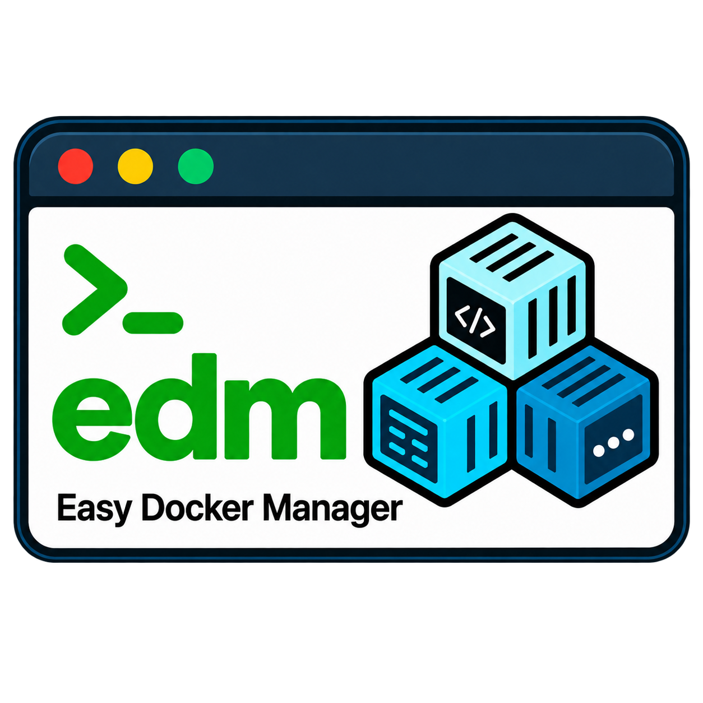

# Easy Docker Manager



[](https://pypi.org/project/easy-docker-manager/)
[](https://pypi.org/project/easy-docker-manager/)
[](https://github.com/arabnejad/edm/actions/workflows/quality.yml)
[](https://github.com/arabnejad/edm/actions/workflows/package.yml)
[](https://github.com/arabnejad/edm/actions/workflows/security.yml)
[](https://github.com/arabnejad/edm/blob/main/LICENSE)

[](https://github.com/arabnejad/edm/issues)
[](https://github.com/arabnejad/edm/pulls)

[](https://github.com/psf/black)
[](https://docs.astral.sh/ruff/)
[](https://mypy-lang.org/)
[](https://github.com/arabnejad/edm/actions/workflows/github-code-scanning/codeql)

Easy Docker Manager (EDM) is a keyboard-driven terminal application for
inspecting Docker containers running on your computer. It uses Urwid for the
terminal interface and the Docker Python SDK to read container data.

EDM provides:

- a list of running containers
- recent logs with automatic updates
- container environment variables
- a readable summary of Docker inspection data
- the process list returned by Docker top
- a separate search query for each container tab
- a local JSON configuration file

## Demo


## Requirements

- Python 3.9 or newer
- Docker installed and running
- permission to access the local Docker daemon

EDM currently supports local Docker only. It accepts the platform's default
local connection, Unix sockets, and Windows named pipes. A `DOCKER_HOST` value
using a remote transport such as TCP or SSH is rejected.

> [!WARNING]
> EDM needs access to the local Docker daemon. This is highly privileged access.
> On Linux, membership in the `docker` group grants root-level privileges. Give
> Docker access only to trusted users, and never make the Docker socket
> world-writable. See Docker's
> [Linux post-installation guidance](https://docs.docker.com/engine/install/linux-postinstall/)
> for supported access options.

## Installation

For normal use, install EDM with `pipx`:

```bash
pipx install easy-docker-manager
```

`pipx` keeps EDM in its own environment and makes the `edm` command available
from your terminal.

You can also install EDM with `pip`. Using a virtual environment keeps it
separate from other Python packages:

```bash
python -m venv .venv
```

Activate the environment on Linux or macOS:

```bash
source .venv/bin/activate
```

Activate it in Windows PowerShell:

```powershell
.venv\Scripts\Activate.ps1
```

Or activate it in Windows Command Prompt:

```bat
.venv\Scripts\activate.bat
```

Then install the package from PyPI:

```bash
python -m pip install easy-docker-manager
```

For work on the source code, follow the
[development setup](DEVELOPMENT_GUIDE.md#development-setup).

## Running EDM

Run the installed command:

```bash
edm
```

You can also run the Python module directly:

```bash
python -m easy_docker_manager.main
```

## Keyboard Controls

| Key | Action |
| --- | --- |
| `q` | Quit EDM |
| `Up` / `Down` | Move through containers or detail lines |
| `Enter` | Move keyboard focus to the detail panel |
| `Esc` | Return keyboard focus to the container list |
| `[` | Open the previous detail tab |
| `]` | Open the next detail tab |
| `/` | Start editing the search for the current tab |
| `Page Up` / `Page Down` | Move through the detail panel one page at a time |
| `Home` / `End` | Select the first or last detail line |

While entering a search, press `Enter` to keep the query and return to detail
navigation. Press `Esc` to keep the query and return to the container list.

## Detail Tabs

| Tab | Contents |
| --- | --- |
| Logs | Recent container logs followed by new log output |
| Env | Configured environment variables and their values |
| Config | Selected container and image inspection data |
| Top | Processes reported by Docker top |

Each container and tab keeps its own search query:

- Logs treats the query as a case-insensitive regular expression and hides
  lines that do not match.
- Env, Config, and Top use case-insensitive plain-text search. Matches are
  highlighted, but no lines are removed.
- An invalid Logs regular expression leaves the log text visible.
- Log regular expressions are limited to 200 characters.

## Configuration

EDM uses `platformdirs` to place `config.json` in the correct user config
directory for the operating system. The file is stored in an `EDM` folder.
Typical locations are:

| Operating system | Typical path |
| --- | --- |
| Linux | `~/.config/EDM/config.json` |
| macOS | `~/Library/Application Support/EDM/config.json` |
| Windows | `%LOCALAPPDATA%\EDM\config.json` |

EDM creates the file on first use. On every later startup, it reads valid
settings and rewrites the file using the settings supported by the installed
version. Missing settings receive their defaults, and unrecognized or invalid
settings are removed.

| Setting | Default | Purpose |
| --- | ---: | --- |
| `refresh_interval` | `2.0` | Seconds between running-container refreshes |
| `tab_refresh_interval` | `2.0` | Seconds between reloads of the visible Env, Config, or Top tab |
| `log_tail` | `100` | Number of recent lines loaded when Logs first opens |
| `max_log_lines` | `2000` | Maximum log lines kept for one container |
| `max_log_line_chars` | `4000` | Maximum characters kept from one log line (minimum `32`) |
| `content_cache_size` | `50` | Maximum number of cached container tabs |
| `content_cache_max_bytes` | `25000000` | Maximum UTF-8 size of all cached tab text |
| `docker_request_timeout` | `10.0` | Docker SDK request timeout in seconds |
| `max_workers` | `4` | Maximum number of background worker threads |

## Application Logs

EDM writes its own application messages to `edm.log` beside `config.json`.
This file contains EDM errors and diagnostic messages, not container logs. It
rotates at 5 MB and keeps three backup files.

These environment variables can change the logging setup:

| Variable | Purpose |
| --- | --- |
| `EDM_LOG_FILE` | Write to a different log file |
| `EDM_LOG_LEVEL` | Set the level, such as `DEBUG` or `WARNING` |
| `EDM_LOG_STDOUT` | Also write logs to standard output when enabled |

`EDM_LOG_STDOUT` is disabled for `0`, `false`, `no`, or `off`. Other values
enable it. If EDM cannot create the log file, it prints a warning to the
terminal and continues to start.

## Development Checks

Run the normal formatting, linting, type, and source-security checks:

```bash
make check
```

Useful individual commands are:

```bash
make black
make black-check
make ruff
make ruff-fix
make mypy
make bandit
make test
make pre-commit
make audit
make security
make package-check
```

`make audit` checks installed dependencies for known vulnerabilities. It needs
Python 3.10 or newer and network access, so it is not part of `make check`.

`make test` prints statement and branch coverage after the unit tests finish.

GitHub Actions runs Black, Ruff, mypy, and Bandit once on Python 3.12. It runs
the unit tests on Python 3.9 through 3.14 and verifies the minimum supported
runtime dependency versions on Python 3.9. It also checks dependencies and
committed secrets, builds the source distribution and wheel, and installs the
wheel on every supported Python version. Dependabot checks Python packages and
GitHub Actions each week.

Workflow actions are pinned to full commit SHAs so CI always runs the exact
reviewed action code instead of a movable version tag. The comment beside each
SHA shows its release version, and Dependabot proposes SHA updates when newer
releases are available.

See [DEVELOPMENT_GUIDE.md](DEVELOPMENT_GUIDE.md) for the code structure,
runtime flow, and instructions for extending EDM.

## Contributing

Bug reports, feature ideas, and code contributions are welcome. Read
[CONTRIBUTING.md](CONTRIBUTING.md) before opening a pull request.

Please report security problems privately by following
[SECURITY.md](SECURITY.md). Do not include sensitive vulnerability details in
a public issue.

## License

Easy Docker Manager is available under the [MIT License](LICENSE).
