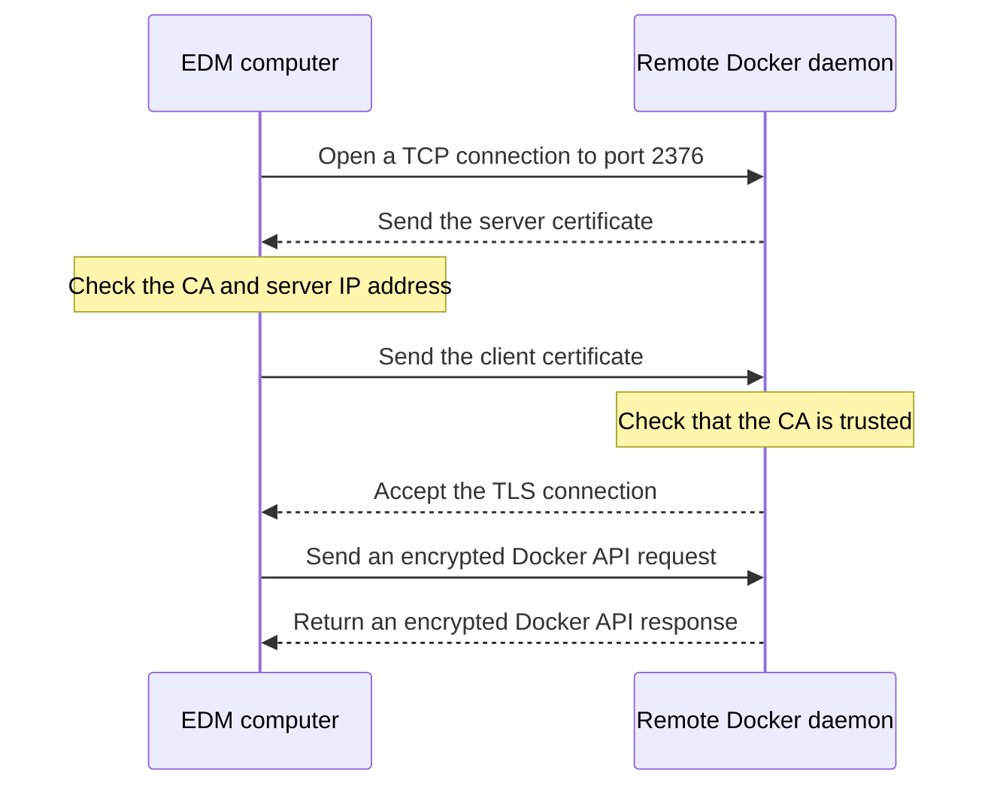
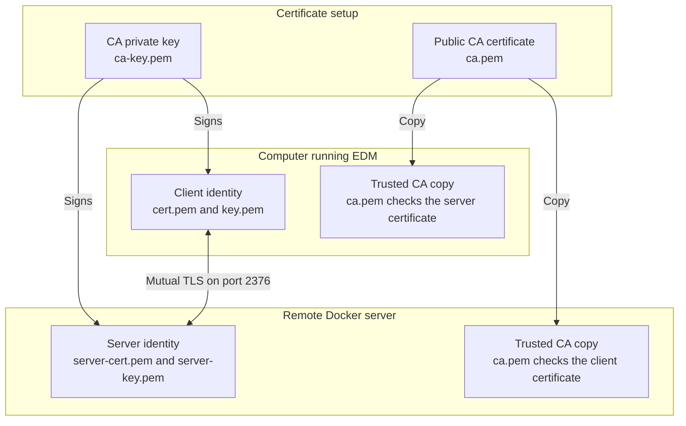
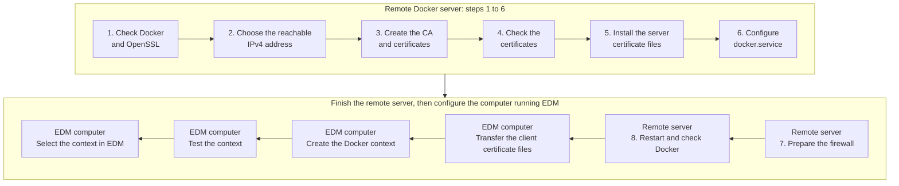
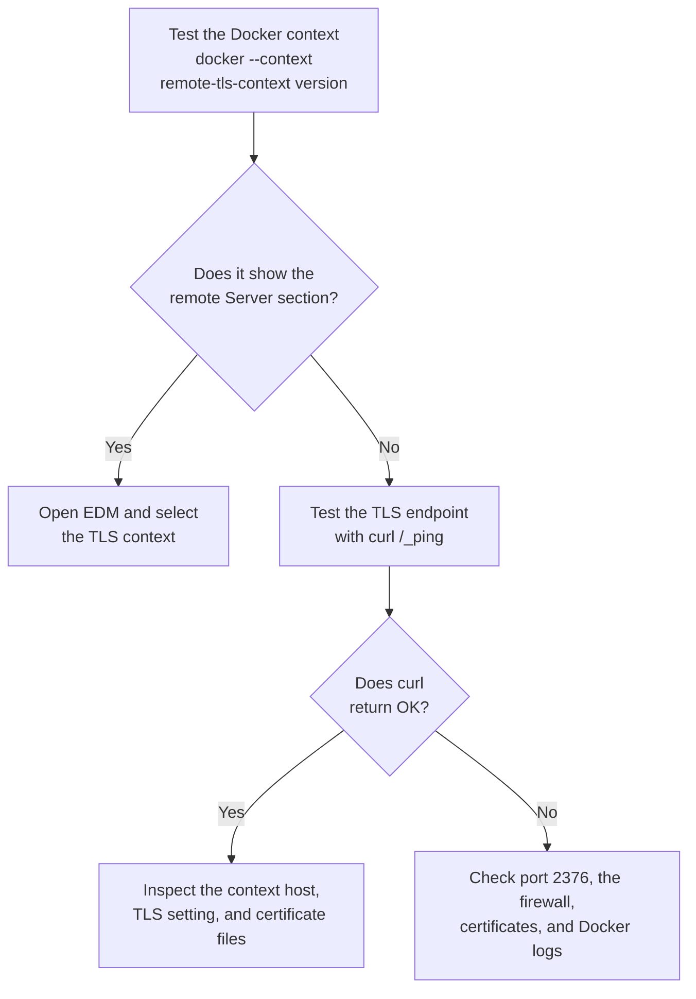

# Connect EDM to Remote Docker with TLS

TLS lets EDM connect directly to a remote Docker daemon over an encrypted TCP
connection. It does not use SSH.

This tutorial assumes the remote machine runs Docker Engine on Linux and uses
`systemd` to manage the Docker service. The output examples use `192.0.2.10`,
which belongs to a range reserved for documentation. Replace it with the real
IPv4 address of your Docker server.

Restarting Docker may interrupt running containers. Schedule the change for a
time when a short Docker restart is acceptable.

## What `docker context create` Does

Run this command on the computer where EDM is installed:

```bash
docker context create remote-tls-context \
  --description "Remote Docker server over TLS" \
  --docker "host=tcp://remote-server-address:2376,ca=/path/to/ca.pem,cert=/path/to/cert.pem,key=/path/to/key.pem"
```

This command only creates a local Docker context. It:

- records the remote Docker address;
- imports the three local certificate files into Docker's context storage;
- gives the connection a name that Docker and EDM can use.

It does not connect to the remote server, ask for a remote password, copy files
to the server, or change the remote Docker daemon. The first connection happens
when you test the context or select it in EDM.

TLS authentication does not use a username or password. The client certificate
and private key are the credentials. However, `docker context create` does not
set up that trust for you. The remote daemon must already trust the CA that
signed the client certificate.

## How the Connection Works



When the connection opens:

1. The client checks that the remote daemon's server certificate was signed by
   the expected CA and belongs to the requested hostname or IP address.
2. The remote daemon checks that the client's certificate was signed by a CA it
   trusts.
3. Docker requests and responses are encrypted for the rest of the connection.

This is called mutual TLS because both sides prove their identity. It is
different from passwordless SSH: no SSH connection or SSH account is involved.
The private keys are never sent across the network.

## Files on Each Computer

| Location | File | Purpose |
| --- | --- | --- |
| Remote Docker server | `ca.pem` | Checks that client certificates were signed by the trusted CA |
| Remote Docker server | `server-cert.pem` | Identifies the Docker server |
| Remote Docker server | `server-key.pem` | Proves that the server owns its certificate |
| Computer running EDM | `ca.pem` | Checks the remote Docker server's certificate |
| Computer running EDM | `cert.pem` | Identifies this Docker client |
| Computer running EDM | `key.pem` | Proves that the client owns its certificate |



The CA private key, commonly named `ca-key.pem`, is used to sign certificates.
It is not needed for normal Docker connections and should be kept in a secure
place rather than copied to either runtime location.

## Configure the Remote Docker Server

The next eight steps are run on the remote Docker server.



### 1. Check Docker and OpenSSL

```bash
docker version --format 'Docker Engine {{.Server.Version}}'
systemctl is-active docker.service
openssl version
```

Expected output looks similar to this:

```text
Docker Engine 29.0.1
active
OpenSSL 3.0.13 30 Jan 2024
```

The versions will probably differ. Stop here if the Docker service is not
`active`.

### 2. Find the Server's IPv4 Address

List the IPv4 addresses assigned to the remote server:

```bash
ip -4 -brief address show scope global
```

Expected output looks similar to this:

```text
eth0             UP             192.0.2.10/24
```

The interface name and address will differ. Remove the network suffix, such as
`/24`, and use the remaining address:

```bash
export TLS_SERVER_IP=192.0.2.10
```

Choose the address that the EDM computer can reach. This is usually a private
address when both computers are on the same network or VPN. On a cloud server,
`ip` may show only a private address even though the EDM computer connects
through a public address. In that case, get the public address from the cloud
provider and use it instead.

This choice matters because the address is written into the server certificate.
Later, on the EDM computer, the same address is used in the Docker context:

```text
host=tcp://${TLS_SERVER_IP}:2376
```

TLS rejects the connection when the context uses an IP address that is not
listed in the server certificate.

### 3. Create the CA and Certificates

Make a private working directory. `TLS_SERVER_IP` keeps the address selected in
the previous step available to the certificate commands.

```bash
mkdir -p ~/docker-tls-setup
chmod 0700 ~/docker-tls-setup
cd ~/docker-tls-setup
```

These commands do not print anything when they succeed.

Create the certificate authority. OpenSSL asks you to choose a password for the
CA private key. This protects the key used to sign certificates; it is not a
password for Docker or EDM.

```bash
openssl genrsa -aes256 -out ca-key.pem 4096
openssl req -new -x509 -days 3650 -sha256 \
  -key ca-key.pem \
  -out ca.pem \
  -subj "/CN=EDM Docker CA"
```

Expected prompts:

```text
Enter PEM pass phrase:                 # Choose the password
Verifying - Enter PEM pass phrase:     # Repeat the same password
Enter pass phrase for ca-key.pem:      # Enter the same password again
```

Do not leave this password empty. Choose a strong password and keep it in a
secure password manager. It protects `ca-key.pem`, which is the private key
used to sign new server and client certificates. The first two prompts create
and confirm the password. Enter the same password at both prompts. The third
prompt unlocks the key while OpenSSL creates `ca.pem`, so enter the same password
again. Every later prompt that mentions `ca-key.pem` also uses this password,
including certificate signing and renewal.

You will enter the CA password again when you:

- sign the server certificate later in this step;
- sign the client certificate later in this step;
- renew either certificate before it expires;
- create another client certificate in the future.

EDM will not ask for the CA password during normal use. The CA private key is
not copied to the EDM computer or loaded by Docker. Of the two CA files, the
client only receives `ca.pem`. This public certificate is used to check the
server's certificate.

The other two private keys have different jobs:

- `server-key.pem` stays on the remote server and is loaded by `dockerd` when
  Docker starts;
- `key.pem` is copied to the EDM computer and is loaded when Docker or EDM
  connects to the remote daemon.

These two runtime keys are created without passwords so `dockerd` and EDM can
use them without stopping for an interactive prompt. Their file permissions
are restricted later in this guide so only the required user can read them.
Never copy `ca-key.pem` to the EDM computer.

> [!WARNING]
> An unencrypted CA private key will work, but it is not recommended. Creating
> one requires removing `-aes256` from the `openssl genrsa` command. Anyone who
> obtains that key could create another trusted client certificate and gain
> control of the remote Docker daemon. Keep `ca-key.pem` password-protected.
> The runtime keys, `server-key.pem` and `key.pem`, remain unencrypted so
> `dockerd` and EDM can start without asking for a password. Protect those keys
> with the strict file permissions shown later in this guide.

Create the server key and certificate request:

```bash
openssl genrsa -out server-key.pem 4096
openssl req -subj '/CN=edm-docker-server' -sha256 -new \
  -key server-key.pem \
  -out server.csr

printf 'subjectAltName = IP:%s\nextendedKeyUsage = serverAuth\n' \
  "$TLS_SERVER_IP" > server-ext.cnf

openssl x509 -req -days 365 -sha256 \
  -in server.csr \
  -CA ca.pem \
  -CAkey ca-key.pem \
  -CAcreateserial \
  -out server-cert.pem \
  -extfile server-ext.cnf
```

The final command asks for the CA password. Successful output ends with lines
similar to these:

```text
Certificate request self-signature ok
subject=CN = edm-docker-server
```

Create the client key and certificate used by Docker and EDM:

```bash
openssl genrsa -out key.pem 4096
openssl req -subj '/CN=edm-client' -new \
  -key key.pem \
  -out client.csr

printf 'extendedKeyUsage = clientAuth\n' > client-ext.cnf

openssl x509 -req -days 365 -sha256 \
  -in client.csr \
  -CA ca.pem \
  -CAkey ca-key.pem \
  -CAcreateserial \
  -out cert.pem \
  -extfile client-ext.cnf
```

Again, the final command asks for the CA password. Expected output includes:

```text
Certificate request self-signature ok
subject=CN = edm-client
```

Protect the private keys and make the signed certificates read-only:

```bash
chmod 0400 ca-key.pem server-key.pem key.pem
chmod 0444 ca.pem server-cert.pem cert.pem
```

These commands do not print anything when they succeed.

### 4. Check the Certificates

```bash
openssl verify -CAfile ca.pem -purpose sslserver server-cert.pem
openssl verify -CAfile ca.pem -purpose sslclient cert.pem
openssl verify -CAfile ca.pem \
  -verify_ip "$TLS_SERVER_IP" server-cert.pem
openssl x509 -in server-cert.pem -noout -ext subjectAltName
printf '\nServer certificate dates:\n'
openssl x509 -in server-cert.pem -noout -dates
printf '\nClient certificate dates:\n'
openssl x509 -in cert.pem -noout -dates
```

Expected output:

```text
server-cert.pem: OK
cert.pem: OK
server-cert.pem: OK
X509v3 Subject Alternative Name:
    IP Address:192.0.2.10
Server certificate dates:
notBefore=Jan  1 00:00:00 2026 GMT
notAfter=Jan  1 00:00:00 2027 GMT
Client certificate dates:
notBefore=Jan  1 00:00:00 2026 GMT
notAfter=Jan  1 00:00:00 2027 GMT
```

Do not continue if one of the verification commands fails. The name used in
the Docker context must appear in the server certificate's Subject Alternative
Name list. `notBefore` is the first time the certificate can be used, and
`notAfter` is its expiry time. OpenSSL prints both values in UTC. Check the two
`notAfter` values and renew the certificates before those dates. Your dates
will be different from the example.

> [!NOTE]
> The CA certificate is valid for ten years because its command uses
> `-days 3650`. The server and client certificates are valid for one year
> because their commands use `-days 365`. X.509 certificates cannot be valid
> forever. You can choose a longer period, but the CA must remain valid for the
> full lifetime of every certificate it signs. Shorter server and client
> certificate lifetimes also limit how long a copied or stolen key can be used.

The certificate requests and temporary extension files are no longer needed:

```bash
rm -f server.csr client.csr server-ext.cnf client-ext.cnf
```

This command does not print anything when it succeeds.

### 5. Install the Server Files

```bash
sudo install -d -m 0700 /etc/docker/tls
sudo install -o root -g root -m 0444 \
  ca.pem server-cert.pem /etc/docker/tls/
sudo install -o root -g root -m 0400 \
  server-key.pem /etc/docker/tls/
sudo ls -l /etc/docker/tls
```

Expected output has these three files. The date and file sizes will differ:

```text
-r--r--r-- 1 root root ... ca.pem
-r--r--r-- 1 root root ... server-cert.pem
-r-------- 1 root root ... server-key.pem
```

The remote server does not need `cert.pem` or `key.pem` while Docker is
running. Those are the client files and will be copied to the EDM computer
later.

### 6. Configure the Docker Service

Do not start a second `dockerd` process or leave `dockerd` running in a shell.
The existing `docker.service` already runs it in the background. Configure that
service and restart it with `systemctl`.

First, back up the existing daemon configuration if it exists:

```bash
if sudo test -f /etc/docker/daemon.json; then
  sudo cp /etc/docker/daemon.json /etc/docker/daemon.json.before-edm-tls
fi
```

The command has no output when it succeeds.

Open the Docker configuration:

```bash
sudo vi /etc/docker/daemon.json
```

If the file is new, use this configuration. If it already contains settings,
add these fields to the existing JSON object instead of deleting the other
fields:

```json
{
  "hosts": [
    "unix:///var/run/docker.sock",
    "tcp://0.0.0.0:2376"
  ],
  "tlsverify": true,
  "tlscacert": "/etc/docker/tls/ca.pem",
  "tlscert": "/etc/docker/tls/server-cert.pem",
  "tlskey": "/etc/docker/tls/server-key.pem"
}
```

`0.0.0.0` makes Docker listen on all network interfaces. The firewall step
below limits which client addresses can reach it. You can use one specific
server interface address instead.

Check the JSON and Docker settings before restarting anything:

```bash
sudo dockerd --validate --config-file=/etc/docker/daemon.json
```

Expected output:

```text
configuration OK
```

Docker cannot receive the `hosts` setting from both `daemon.json` and the
service command line. Check the current service command:

```bash
sudo systemctl show docker.service --property=ExecStart
```

A common result is:

```text
ExecStart={ path=/usr/bin/dockerd ; argv[]=/usr/bin/dockerd -H fd:// --containerd=/run/containerd/containerd.sock ; ... }
```

If the output contains `-H`, create a service override:

```bash
sudo systemctl edit docker.service
```

Add these three lines above the editor's `Lines below this comment will be
discarded` marker:

```ini
[Service]
ExecStart=
ExecStart=/usr/bin/dockerd --containerd=/run/containerd/containerd.sock
```

The empty `ExecStart=` removes the command supplied by the original service.
The next line keeps the original `--containerd` setting but removes `-H fd://`,
allowing Docker to read its listening addresses from `daemon.json`. If the
original command contains other arguments, keep those arguments too and remove
only the `-H` argument and its value.

Save the override, reload systemd, and check the effective command:

```bash
sudo systemctl daemon-reload
sudo systemctl show docker.service --property=ExecStart
```

The new output must not contain `-H fd://`. If it still appears, the override
was not saved in the editable part of the file. Run the edit command again and
correct the override before restarting Docker.

### 7. Prepare the Firewall

Prepare the firewall before restarting Docker so the new listener is restricted
as soon as it starts. Only allow the source address used by the EDM computer to
reach port `2376`.

On Ubuntu, check whether UFW is already protecting the server:

```bash
sudo ufw status verbose
```

If it is active, the relevant output should show a default policy that denies
incoming traffic:

```text
Status: active
Default: deny (incoming), allow (outgoing), disabled (routed)
```

Use the address that the server sees as the connection source. This may be the
EDM computer's public or VPN address rather than an address assigned directly
to it. If the current SSH session came from the EDM computer, the first address
printed by this command is usually the one you need:

```bash
echo "$SSH_CONNECTION"
```

For example:

```text
198.51.100.25 51342 192.0.2.10 22
```

In this example, `198.51.100.25` is the client address. Add a rule that allows
only that address to reach the Docker TLS port:

```bash
sudo ufw allow proto tcp from 198.51.100.25 to any port 2376
sudo ufw status | grep 2376
```

Expected output looks similar to this:

```text
Rule added
2376/tcp                  ALLOW       198.51.100.25
```

If `sudo ufw status verbose` reports `Status: inactive`, UFW is not filtering
traffic. Do not restart Docker with `2376` listening on `0.0.0.0` until UFW or
another firewall restricts that port.

Before enabling UFW, allow SSH so you do not lock yourself out. Keep the current
SSH session open while running these commands:

```bash
sudo ufw default deny incoming
sudo ufw default allow outgoing
sudo ufw allow OpenSSH
sudo ufw allow proto tcp from 198.51.100.25 to any port 2376
sudo ufw enable
sudo ufw status verbose
```

The `OpenSSH` profile normally allows port `22`. If this server uses a different
SSH port, allow that port before enabling UFW. The final output should show that
UFW is active, incoming traffic is denied by default, and rules exist for SSH
and port `2376`.

Open a second SSH connection and confirm that it works before closing the
original session. If the second connection fails, keep the original session
open while correcting the firewall rules.

Do not assume that the allow rule blocks other clients when UFW is inactive or
its default incoming policy is `allow`. Review the firewall configuration with
the server administrator first. If the server uses firewalld, a cloud security
group, or another network firewall, create an equivalent restricted rule there.

### 8. Restart and Check Docker

```bash
sudo systemctl daemon-reload
sudo systemctl restart docker.service
systemctl is-active docker.service
sudo ss -lntp | grep -E ':(2375|2376)'
docker version --format 'Local socket: Docker Engine {{.Server.Version}}'
```

Expected output looks similar to this:

```text
active
LISTEN 0 4096 0.0.0.0:2376 0.0.0.0:* users:(("dockerd",pid=1234,fd=7))
Local socket: Docker Engine 29.0.1
```

Only port `2376` should appear. Port `2375` is normally used for unencrypted
Docker API traffic. Stop and check the daemon configuration if `2375` is also
listening.

At this point, `systemd` is running Docker in the background. It will also
start Docker after the server reboots. You do not need to run `dockerd`
yourself.

If Docker does not become active, inspect its log:

```bash
sudo journalctl -u docker.service -n 50 --no-pager
```

Common causes are invalid JSON, an incorrect certificate path, or a `hosts`
setting still supplied in two places.

## Prepare the Computer Running EDM

The remaining commands are run on the computer where EDM is installed.

Create a private directory for the client files:

```bash
mkdir -p ~/.docker/edm-remote
chmod 0700 ~/.docker/edm-remote
export TLS_SERVER_IP=192.0.2.10
```

Use the same real server address here that you assigned to `TLS_SERVER_IP` on
the remote server.

Securely transfer these files from the remote server:

```text
ca.pem
cert.pem
key.pem
```

You can use `scp` for this one-time transfer:

```bash
scp remote-admin@192.0.2.10:docker-tls-setup/{ca.pem,cert.pem,key.pem} \
  ~/.docker/edm-remote/
```

This `scp` command may ask for the remote account password. That password is
only used to transfer the files; TLS connections from Docker and EDM will not
use it. You can use any other secure file-transfer method instead.

Typical `scp` output looks like this:

```text
remote-admin@192.0.2.10's password:
ca.pem                                    100% ...
cert.pem                                  100% ...
key.pem                                   100% ...
```

Do not transfer `server-key.pem` or `ca-key.pem` to the EDM computer. Protect
the client private key so that other users cannot read it:

```bash
chmod 0400 ~/.docker/edm-remote/key.pem
chmod 0444 ~/.docker/edm-remote/ca.pem ~/.docker/edm-remote/cert.pem
```

Now create the context. The endpoint uses that address. This command reads
local files and does not contact the remote server:

```bash
docker context create remote-tls-context \
  --description "Remote Docker server over TLS" \
  --docker "host=tcp://${TLS_SERVER_IP}:2376,ca=$HOME/.docker/edm-remote/ca.pem,cert=$HOME/.docker/edm-remote/cert.pem,key=$HOME/.docker/edm-remote/key.pem"
```

Expected output:

```text
remote-tls-context
Successfully created context "remote-tls-context"
```

Inspect the context before making the first connection:

```bash
docker context inspect remote-tls-context
```

The output should contain values similar to these:

```json
{
  "Endpoints": {
    "docker": {
      "Host": "tcp://192.0.2.10:2376",
      "SkipTLSVerify": false
    }
  },
  "TLSMaterial": {
    "docker": ["ca.pem", "cert.pem", "key.pem"]
  }
}
```

The real output contains additional fields. Confirm that the host is correct,
TLS verification is enabled, and all three client files are listed.

Test the connection before opening EDM:

```bash
docker --context remote-tls-context version
docker --context remote-tls-context ps
```

These commands make the first network connection. They should authenticate
with the client certificate without asking for an SSH or remote account
password. The `version` output should contain both `Client` and `Server`
sections. The `ps` output should list containers from the remote daemon, or an
empty table if it has no containers.

You can also test the TLS endpoint without using a Docker context:

```bash
curl --fail --show-error \
  --cacert "$HOME/.docker/edm-remote/ca.pem" \
  --cert "$HOME/.docker/edm-remote/cert.pem" \
  --key "$HOME/.docker/edm-remote/key.pem" \
  "https://${TLS_SERVER_IP}:2376/_ping"
```

Expected output:

```text
OK
```

If this command fails, its error usually points to the network or certificate
problem before Docker context handling is involved.

After the tests pass, store `ca-key.pem` in an offline backup or a protected
secret store. It is the key that can create new trusted certificates. Also
remove the extra copy of the client `key.pem` from the remote setup directory
after confirming that the EDM computer has a protected copy.

Open EDM, press `c` or `C`, select `remote-tls-context`, and press `Enter`.

## Use Environment Variables Instead

EDM also supports Docker's TLS environment variables:

```bash
export TLS_SERVER_IP=192.0.2.10
export DOCKER_HOST="tcp://${TLS_SERVER_IP}:2376"
export DOCKER_TLS_VERIFY=1
export DOCKER_CERT_PATH="$HOME/.docker/edm-remote"
edm
```

The directory in `DOCKER_CERT_PATH` must contain `ca.pem`, `cert.pem`, and
`key.pem`. This is a local path on the computer where EDM runs. It is not a
path on the remote Docker server. Replace `192.0.2.10` with the real server
address, as described earlier in this guide.

The two locations contain different runtime files:

```text
EDM computer:          ~/.docker/edm-remote/ca.pem
                       ~/.docker/edm-remote/cert.pem
                       ~/.docker/edm-remote/key.pem

Remote Docker server: /etc/docker/tls/ca.pem
                       /etc/docker/tls/server-cert.pem
                       /etc/docker/tls/server-key.pem
```

## Common Problems

Use these checks in order. Each result tells you which part of the connection
to inspect next.



| Error | Likely cause |
| --- | --- |
| `hosts` is specified both as a flag and in the configuration file | The systemd command still contains `-H fd://`; save the service override from step 6 and reload systemd |
| Connection refused or timed out | Docker is not listening on port `2376`, or a firewall blocks the connection |
| Certificate is valid for a different name | The server certificate does not include the hostname or IP address used by the context |
| Certificate signed by unknown authority | The client has the wrong `ca.pem` |
| Bad certificate or certificate required | The server does not trust the client certificate, or the client files are incorrect |
| Context is unavailable in EDM | A certificate file is missing or server verification is disabled |

EDM deliberately rejects plain TCP contexts and contexts created with
`skip-tls-verify`. A remote Docker connection has control over the server, so
encrypting the traffic without checking identities is not enough.

## References

- [Docker: Protect the Docker daemon socket](https://docs.docker.com/engine/security/protect-access/)
- [Docker: Configure remote access for the Docker daemon](https://docs.docker.com/engine/daemon/remote-access/)
- [Docker: Configure the Docker daemon](https://docs.docker.com/engine/daemon/)
- [Docker: `dockerd` command reference](https://docs.docker.com/reference/cli/dockerd/)
- [Docker: Create a Docker context](https://docs.docker.com/reference/cli/docker/context/create/)
- [Docker: Understand and inspect Docker contexts](https://docs.docker.com/engine/manage-resources/contexts/)
- [OpenSSL: Display certificate fields with `openssl x509`](https://docs.openssl.org/4.0/man1/openssl-x509/)
- [OpenSSL: Verify certificates with `openssl verify`](https://docs.openssl.org/master/man1/openssl-verify/)
- [Ubuntu Server: Configure a firewall with UFW](https://documentation.ubuntu.com/server/how-to/security/firewalls/)
- [IETF RFC 5737: IPv4 address ranges reserved for documentation](https://www.rfc-editor.org/rfc/rfc5737.html)
- [Flatcar: Enable the Docker remote API with TLS authentication](https://www.flatcar.org/docs/latest/orchestrate/containers/customizing-docker/#enable-the-remote-api-with-tls-authentication)
- [JetBrains: Configure a Docker TCP connection and certificate folder](https://www.jetbrains.com/help/idea/settings-docker.html)
- [GitLab: Use Docker over TLS on port 2376](https://docs.gitlab.com/ci/docker/docker_in_docker/#docker-in-docker-with-tls-enabled-in-kubernetes)
- [Portainer: Connect to a remote Docker API with TLS](https://docs.portainer.io/admin/environments/add/docker/api)
- [Oracle Linux: Docker security recommendations](https://docs.oracle.com/en/operating-systems/oracle-linux/docker/docker-SecurityRecommendations.html)
- [Cloudflare: How mutual TLS works](https://www.cloudflare.com/learning/access-management/what-is-mutual-tls/)
