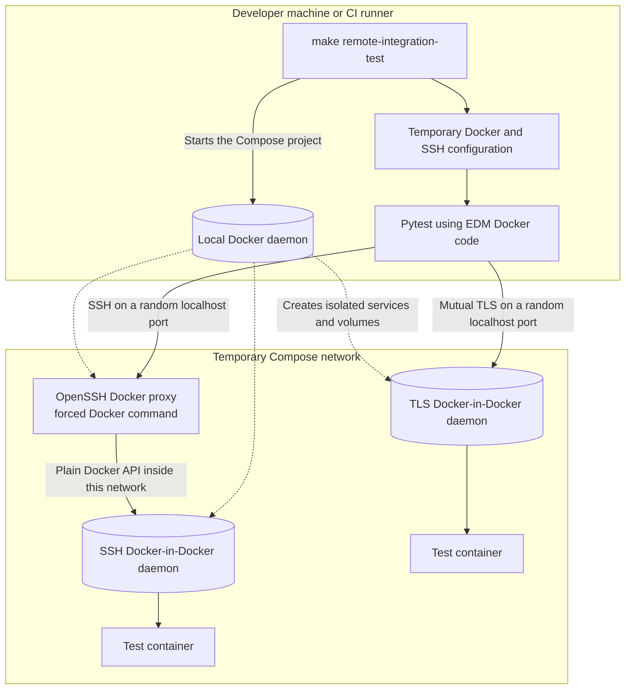

# Docker Integration Tests

These tests check EDM against real Docker daemons. They complement the unit
tests, which use mock Docker objects and do not connect to Docker.

## What The Tests Check

The local suite verifies that EDM can:

- find a running container
- read its logs
- read its environment variables
- load its container and image inspection data
- read its running process information
- read its resource statistics
- restart and stop it

## How The Test Setup Works

1. Pytest connects to the local Docker daemon.
2. It pulls the small `alpine:3.20` image.
3. It starts one container with a unique name.
4. The container writes a known log message and then remains running.
5. Each test reads part of the container through
   `DockerSDKContainerClient`, the same class used by EDM.
6. After all tests finish, pytest removes the container and closes the Docker
   clients. Cleanup also runs when a test fails.

The same container is shared by all local integration tests. This keeps the
suite quick and avoids repeatedly pulling the image or starting new containers.

The remote suite creates two isolated Docker-in-Docker daemons. One uses mutual
TLS and the other is reached through a real OpenSSH server. It checks that EDM
can discover each Docker context, validate the connection, switch to it, list a
running container, read its logs, and read daemon details.

### Remote Test Layout



The local Docker daemon starts the test services, but EDM does not use it for
the remote connection checks. For the TLS case, EDM connects straight to the
TLS daemon and verifies both sides of the connection. For the SSH case, the SSH
proxy accepts the test key and forwards Docker traffic to the second daemon on
the private Compose network. Neither remote daemon mounts the host Docker
socket.

The runner creates temporary Docker contexts for these two routes. Pytest uses
each context to start a test container, read data through EDM, and remove the
container. When pytest finishes, the runner removes the contexts, Compose
services, volumes, and temporary files.

## Run The Tests

From the project root, run:

```bash
make integration-test
```

Run the SSH and TLS tests with:

```bash
make remote-integration-test
```

Run both suites with:

```bash
make all-integration-tests
```

The remote command needs Docker Compose and a local daemon that can start
privileged containers. It creates a temporary `DOCKER_CONFIG`, SSH home
directory, Compose project, and Docker volumes. Its cleanup handler removes all
of them whether the tests pass or fail. It does not read or change the Docker
contexts in your normal home directory.

The normal `make test` command runs only unit tests. It does not start any
containers.

## Use A Different Image

Set `EDM_INTEGRATION_TEST_IMAGE` to use another Alpine-compatible image:

```bash
EDM_INTEGRATION_TEST_IMAGE=alpine:3.21 make integration-test
```

The image must provide `sh`, `echo`, and `sleep` because the temporary container
uses those commands while the tests run.

Use `EDM_REMOTE_INTEGRATION_TEST_IMAGE` for the remote suite:

```bash
EDM_REMOTE_INTEGRATION_TEST_IMAGE=alpine:3.21 make remote-integration-test
```

## Test Credentials

The TLS certificates and SSH keys under `remote/fixtures` are public test data.
They are used only with short-lived local containers and must not be used on a
real server. The fixture README explains how to regenerate them.

## When Docker Is Unavailable

The local integration tests are skipped when they cannot connect to Docker.
The remote runner needs Docker before it can create its test services, so it
reports missing Docker access as an error. Other failures, such as an image
pull failure or incorrect data returned by EDM, also fail normally.

GitHub Actions runs both suites in separate Python 3.12 jobs. The workflows
check Docker access first, so Docker being unavailable in CI causes a job to
fail instead of silently skipping its tests.
